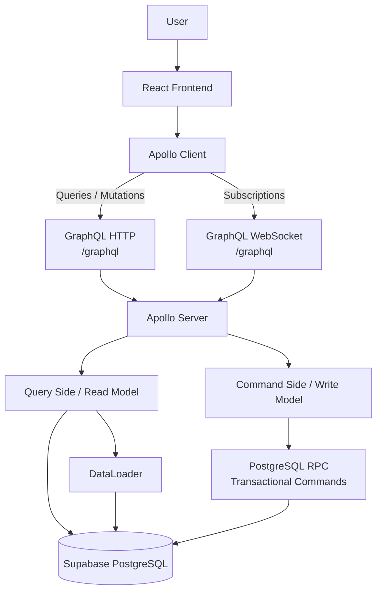

# Afirmative Pill

## GraphQL & CQRS Architecture for Pharmaceutical E-Commerce

Afirmative Pill is an academic software architecture project that implements a pharmaceutical e-commerce platform using **GraphQL, Apollo, CQRS, PostgreSQL and React**.

The system allows users to browse medications, search the pharmaceutical catalog, inspect detailed medication information, manage a shopping cart, create orders, validate prescription requirements, reserve inventory consistently and track order status in real time.

The project was designed around the following architectural requirements:

- GraphQL as the exclusive client-server communication mechanism.
- Apollo Server in the backend.
- Apollo Client in the frontend.
- CQRS separation between Queries and Commands.
- PostgreSQL hosted in Supabase.
- Transactional inventory management.
- DataLoader for N+1 mitigation.
- GraphQL Subscriptions for real-time order updates.
- Zero REST communication between frontend and backend.

---

# 1. Project Objective

The goal of Afirmative Pill is to solve several architectural challenges commonly found in pharmaceutical e-commerce systems.

These include:

- Efficient pharmaceutical catalog exploration.
- Avoiding over-fetching when users only require summarized medication information.
- Handling medications that require medical prescriptions.
- Preventing inventory overselling during concurrent purchases.
- Separating read and write responsibilities through CQRS.
- Providing projected order information optimized for the user interface.
- Handling eventual consistency in order status.
- Providing real-time updates when an order changes state.

---

# 2. Architecture

The application follows the following architecture:



The frontend never connects directly to Supabase.

All frontend-backend communication is performed using GraphQL.

### HTTP GraphQL endpoint

```text
http://localhost:4000/graphql
```

### GraphQL WebSocket endpoint

```text
ws://localhost:4000/graphql
```

---

# 3. Technology Stack

| Layer | Technology |
|---|---|
| Frontend | React |
| Frontend Build Tool | Vite |
| GraphQL Client | Apollo Client |
| Local Client State | React Context |
| Backend | Node.js |
| GraphQL Server | Apollo Server |
| HTTP Server | Express |
| WebSocket | graphql-ws + ws |
| Database | PostgreSQL |
| Database Platform | Supabase |
| Batch Resolution | DataLoader |
| GraphQL Schema | SDL |
| Architecture Pattern | CQRS |
| Version Control | Git |

---

# 4. Repository Structure

The application is divided into independent frontend and backend projects.

```text
Taller GraphQL/
│
├── backend/
│   │
│   ├── src/
│   │   │
│   │   ├── commands/
│   │   │   ├── createOrderCommand.js
│   │   │   ├── validatePrescriptionCommand.js
│   │   │   ├── dispatchOrderCommand.js
│   │   │   └── cancelOrderCommand.js
│   │   │
│   │   ├── queries/
│   │   │   ├── medicationQueries.js
│   │   │   └── orderQueries.js
│   │   │
│   │   ├── loaders/
│   │   │   └── medicationLoader.js
│   │   │
│   │   ├── config/
│   │   │   └── supabase.js
│   │   │
│   │   ├── pubsub/
│   │   │   └── pubsub.js
│   │   │
│   │   ├── resolvers/
│   │   │   └── index.js
│   │   │
│   │   ├── schema/
│   │   │   └── typeDefs.js
│   │   │
│   │   └── index.js
│   │
│   ├── .env
│   ├── package.json
│   └── package-lock.json
│
├── frontend/
│   │
│   ├── src/
│   │   │
│   │   ├── components/
│   │   ├── context/
│   │   ├── graphql/
│   │   ├── hooks/
│   │   ├── lib/
│   │   ├── pages/
│   │   ├── App.jsx
│   │   ├── App.css
│   │   ├── index.css
│   │   └── main.jsx
│   │
│   ├── package.json
│   └── package-lock.json
│
├── .gitignore
└── README.md
```

---

# 5. Database

The application uses **PostgreSQL hosted in Supabase**.

The provided dataset contains **50 pharmaceutical products**.

The medication information includes:

```text
id
sku
name
active_ingredient
category
dosage
presentation
price
stock
requires_prescription
manufacturer
description
```

The main database tables are:

```text
medications
orders
order_items
```

---

# 6. Database Relationships

The simplified database model is:

```text
┌──────────────────────────┐
│       medications        │
│──────────────────────────│
│ id PK                    │
│ sku                      │
│ name                     │
│ active_ingredient        │
│ category                 │
│ dosage                   │
│ presentation             │
│ price                    │
│ stock                    │
│ requires_prescription    │
│ manufacturer             │
│ description              │
└─────────────┬────────────┘
              │
              │ medication_id
              │
              ▼
┌──────────────────────────┐
│       order_items        │
│──────────────────────────│
│ id PK                    │
│ order_id FK              │
│ medication_id FK         │
│ quantity                 │
│ unit_price               │
└─────────────┬────────────┘
              │
              │ order_id
              │
              ▼
┌──────────────────────────┐
│          orders          │
│──────────────────────────│
│ id PK                    │
│ status                   │
│ total                    │
│ prescription_reference   │
│ prescription_verified    │
│ created_at               │
│ updated_at               │
└──────────────────────────┘
```

`order_items.unit_price` stores the medication price at the moment the order is created.

This prevents historical orders from changing if the current medication price is modified later.

---

# 7. Medication Search Indexes

The catalog supports searching by:

- Medication name.
- Active ingredient.
- Therapeutic category.

PostgreSQL indexes were created to improve catalog searching.

The project uses `pg_trgm` for efficient partial text searches on medication names and active ingredients.

Conceptually, the backend can perform searches such as:

```sql
WHERE
    name ILIKE '%amoxi%'
    OR active_ingredient ILIKE '%amoxi%'
    OR category ILIKE '%amoxi%'
```

---

# 8. GraphQL

GraphQL is the only communication mechanism between the frontend and backend.

There are no REST endpoints used by the frontend for:

- Catalog.
- Search.
- Medication details.
- Order creation.
- Prescription validation.
- Order cancellation.
- Order dispatch.
- Order tracking.

Queries and Mutations use:

```text
http://localhost:4000/graphql
```

Subscriptions use:

```text
ws://localhost:4000/graphql
```

---

# 9. GraphQL Schema

The following SDL represents the main GraphQL contract implemented by the application.

```graphql
type Medication {
  id: Int!
  sku: String!
  name: String!
  activeIngredient: String!
  category: String!
  dosage: String!
  presentation: String!
  price: Int!
  stock: Int!
  requiresPrescription: Boolean!
  manufacturer: String!
  description: String!
}

enum OrderStatus {
  PENDING_APPROVAL
  APPROVED
  DISPATCHED
  CANCELLED
}

type OrderItem {
  id: ID!
  medicationId: Int!
  quantity: Int!
  unitPrice: Int!
  medication: Medication!
}

type Order {
  id: ID!
  status: OrderStatus!
  total: Int!
  prescriptionReference: String
  prescriptionVerified: Boolean!
  createdAt: String!
  items: [OrderItem!]!
}

input OrderItemInput {
  medicationId: Int!
  quantity: Int!
}

input CreateOrderInput {
  items: [OrderItemInput!]!
  prescriptionReference: String
}

type MutationError {
  code: String!
  message: String!
}

type CreateOrderPayload {
  success: Boolean!
  order: Order
  errors: [MutationError!]!
}

type OrderCommandPayload {
  success: Boolean!
  order: Order
  errors: [MutationError!]!
}

type Query {
  hello: String!

  medications(
    search: String
  ): [Medication!]!

  medication(
    id: Int!
  ): Medication

  order(
    id: ID!
  ): Order
}

type Mutation {
  createOrder(
    input: CreateOrderInput!
  ): CreateOrderPayload!

  validatePrescription(
    orderId: ID!
  ): OrderCommandPayload!

  dispatchOrder(
    orderId: ID!
  ): OrderCommandPayload!

  cancelOrder(
    orderId: ID!
  ): OrderCommandPayload!
}

type Subscription {
  orderStatusChanged(
    orderId: ID!
  ): Order!
}
```

The source of truth for the schema is located at:

```text
backend/src/schema/typeDefs.js
```

If the schema changes, this README should be updated to match the SDL defined in that file.

---

# 10. Catalog Query

The catalog uses a summarized GraphQL selection.

Example:

```graphql
query GetMedications($search: String) {
  medications(search: $search) {
    id
    name
    price
    presentation
    requiresPrescription
  }
}
```

This intentionally avoids requesting unnecessary clinical fields such as:

```text
description
manufacturer
dosage
activeIngredient
stock
```

This demonstrates one of the main advantages of GraphQL:

**the client selects exactly the fields required by the current view.**

---

# 11. Medication Detail Query

When a user opens a medication detail page, additional information is requested.

Example:

```graphql
query GetMedication($id: Int!) {
  medication(id: $id) {
    id
    sku
    name
    activeIngredient
    category
    dosage
    presentation
    price
    stock
    requiresPrescription
    manufacturer
    description
  }
}
```

Therefore:

```text
Catalog
   ↓
Small field selection

Medication Detail
   ↓
Extended field selection
```

This reduces unnecessary over-fetching.

---

# 12. Medication Search

The catalog allows users to search using:

```graphql
medications(search: "amoxi")
```

The backend searches the value against:

```text
name
active_ingredient
category
```

The filtering occurs in the backend and database.

The frontend does not download the entire catalog and perform the main search using a JavaScript `.filter()` operation.

The user interface also uses a small debounce to avoid unnecessary requests on every immediate keystroke.

---

# 13. Order Projection

Orders are exposed using a GraphQL Read Model.

Example:

```graphql
query GetOrder($id: ID!) {
  order(id: $id) {
    id
    status
    total
    prescriptionReference
    prescriptionVerified
    createdAt

    items {
      id
      medicationId
      quantity
      unitPrice

      medication {
        id
        name
        presentation
      }
    }
  }
}
```

The nested medication resolution is optimized using DataLoader.

---

# 14. CQRS

The project applies **Command Query Responsibility Segregation**.

Read operations and write operations are separated conceptually and technically.

## Query Side

Located in:

```text
backend/src/queries/
```

Examples:

```text
medicationQueries.js
orderQueries.js
```

The Query Side handles:

```text
medications
medication
order
```

These operations do not express domain state changes.

---

## Command Side

Located in:

```text
backend/src/commands/
```

Commands include:

```text
createOrderCommand.js
validatePrescriptionCommand.js
dispatchOrderCommand.js
cancelOrderCommand.js
```

Commands represent explicit business intentions.

Instead of exposing a generic operation such as:

```text
updateOrderStatus
```

the application exposes business-oriented operations:

```text
createOrder
validatePrescription
dispatchOrder
cancelOrder
```

This makes business rules and allowed state transitions explicit.

---

# 15. Order Creation

Orders are created using:

```graphql
mutation CreateOrder($input: CreateOrderInput!) {
  createOrder(input: $input) {
    success

    order {
      id
      status
      total
    }

    errors {
      code
      message
    }
  }
}
```

Example input:

```graphql
{
  items: [
    {
      medicationId: 3
      quantity: 1
    }
  ]
  prescriptionReference: "FORMULA-001"
}
```

---

# 16. Business Invariants

The system protects the main pharmaceutical business rules.

An order must contain at least one item.

Every requested quantity must be greater than zero.

The same medication cannot appear multiple times in the same order.

Every requested medication must exist.

There must be sufficient stock for every requested medication.

A prescription reference is required when an order contains a medication where:

```text
requires_prescription = true
```

A prescription order cannot be approved until its prescription has been validated.

Only an `APPROVED` order can be dispatched.

A `DISPATCHED` order cannot be cancelled.

Cancelling a valid non-dispatched order restores reserved inventory.

---

# 17. Domain Errors

Mutations return structured domain errors instead of converting every validation problem into an internal server error.

Example:

```json
{
  "success": false,
  "order": null,
  "errors": [
    {
      "code": "PRESCRIPTION_REQUIRED",
      "message": "A prescription reference is required for this order."
    }
  ]
}
```

Domain error codes include:

```text
EMPTY_ORDER
INVALID_QUANTITY
DUPLICATE_MEDICATION
MEDICATION_NOT_FOUND
INSUFFICIENT_STOCK
PRESCRIPTION_REQUIRED
PRESCRIPTION_NOT_FOUND
ORDER_NOT_FOUND
INVALID_ORDER_STATUS
```

Unexpected infrastructure errors are handled separately.

---

# 18. Order Status Model

The application uses four operational states:

```text
PENDING_APPROVAL
APPROVED
DISPATCHED
CANCELLED
```

The main state flow is:

```text
                         createOrder
                              │
                ┌─────────────┴─────────────┐
                │                           │
            OTC order               Prescription order
                │                           │
                ▼                           ▼
            APPROVED                 PENDING_APPROVAL
                │                           │
                │                  validatePrescription
                │                           │
                │                           ▼
                │                       APPROVED
                │                           │
                └────────────┬──────────────┘
                             │
                     ┌───────┴────────┐
                     │                │
                 dispatch          cancel
                     │                │
                     ▼                ▼
                DISPATCHED        CANCELLED
```

Cancellation is allowed from:

```text
PENDING_APPROVAL
APPROVED
```

Cancellation is not allowed from:

```text
DISPATCHED
CANCELLED
```

---

# 19. Transactional Inventory Management

Inventory consistency is one of the most important domain requirements.

The project does not simply perform:

```text
Read stock
↓
Check stock
↓
Update stock
```

as separate application operations.

Doing so could allow a race condition.

Example:

```text
Available stock = 1

Customer A reads stock = 1
Customer B reads stock = 1

Customer A buys 1
Customer B buys 1

Result:
2 units sold although only 1 existed
```

To prevent this, order creation is implemented using a PostgreSQL transactional function executed using Supabase RPC.

The process is conceptually:

```text
createOrder
    ↓
lock requested medications
    ↓
validate items
    ↓
validate medication existence
    ↓
validate stock
    ↓
validate prescription
    ↓
calculate total
    ↓
create order
    ↓
create order items
    ↓
decrement stock
    ↓
commit
```

Rows involved in the order are locked using:

```sql
FOR UPDATE
```

This means a concurrent order must wait until the first transaction releases the affected rows.

Example:

```text
Stock = 1

Order A
   ↓
Locks medication row
   ↓
Stock is valid
   ↓
Stock becomes 0
   ↓
Transaction completes

Order B
   ↓
Waits for lock
   ↓
Reads stock = 0
   ↓
INSUFFICIENT_STOCK
```

This prevents inventory overselling.

---

# 20. Inventory Restoration on Cancellation

Inventory is reserved when an order is successfully created.

If an order is cancelled before dispatch, the reserved stock is restored.

Example:

```text
Initial stock = 50

createOrder quantity = 2
        ↓
Stock = 48

cancelOrder
        ↓
Stock = 50
```

The cancellation process is also executed through a PostgreSQL transactional function.

---

# 21. Prescription Validation

If no selected medication requires a prescription, a successfully created order starts as:

```text
APPROVED
```

If at least one medication requires a prescription, the order must provide:

```text
prescriptionReference
```

After creation its state is:

```text
PENDING_APPROVAL
```

The command:

```graphql
validatePrescription
```

transitions the order:

```text
PENDING_APPROVAL
        ↓
APPROVED
```

and sets:

```text
prescriptionVerified = true
```

---

# 22. Dispatch Order

Only an approved order can be dispatched.

The command:

```graphql
dispatchOrder
```

performs:

```text
APPROVED
    ↓
DISPATCHED
```

Attempts to dispatch an order in another state return:

```text
INVALID_ORDER_STATUS
```

---

# 23. Cancel Order

The command:

```graphql
cancelOrder
```

supports:

```text
PENDING_APPROVAL → CANCELLED

APPROVED → CANCELLED
```

The command also restores the inventory reserved by the order.

A dispatched order cannot be cancelled.

---

# 24. N+1 Problem

The following GraphQL Query contains a nested relation:

```graphql
query {
  order(id: "ORDER_UUID") {
    items {
      medication {
        id
        name
      }
    }
  }
}
```

A naive implementation could produce:

```text
1 query for order_items

+

1 query for medication 1
1 query for medication 5
1 query for medication 8
1 query for medication 14
```

For an order containing `N` medications, the backend could therefore execute approximately:

```text
1 + N
```

queries.

This is known as the **N+1 problem**.

---

# 25. DataLoader

The project mitigates N+1 using **DataLoader**.

Each GraphQL request receives its own DataLoader instance.

Instead of executing:

```text
Medication 1 → Database

Medication 5 → Database

Medication 8 → Database
```

DataLoader batches the IDs:

```text
[1, 5, 8]
```

and performs one database operation conceptually equivalent to:

```sql
WHERE id IN (1, 5, 8)
```

The implementation also maintains DataLoader's per-request cache.

This means duplicate medication resolutions during the same GraphQL request can reuse the already-loaded result.

The backend includes a demonstration log:

```text
[DATALOADER BATCH] Fetching medication IDs: [ 1, 5, 8 ]
```

This makes batching visible during the project demonstration.

---

# 26. DataLoader Scope

The DataLoader is created in Apollo's request context.

Conceptually:

```text
Request A
   ↓
DataLoader A

Request B
   ↓
DataLoader B
```

A global DataLoader instance is intentionally avoided.

This prevents cache data from being unintentionally shared between unrelated requests.

---

# 27. Frontend with Apollo Client

The frontend is implemented using React and Apollo Client.

Apollo is provided to the React tree through:

```jsx
<ApolloProvider client={apolloClient}>
  <App />
</ApolloProvider>
```

The application uses:

```text
useQuery
useMutation
InMemoryCache
GraphQL subscriptions
```

UI components explicitly handle:

```text
loading
error
data
```

states.

---

# 28. Apollo Client Links

Apollo Client separates HTTP and WebSocket GraphQL operations using a split link.

Conceptually:

```text
                        Apollo Client
                             │
                         split link
                        /          \
                       /            \
             Subscription?           Query / Mutation
                    │                     │
                    ▼                     ▼
              GraphQLWsLink            HttpLink
                    │                     │
                    ▼                     ▼
      ws://localhost:4000/graphql   http://localhost:4000/graphql
```

Queries and Mutations use HTTP.

Subscriptions use WebSocket.

Both channels use GraphQL.

---

# 29. Cart

The shopping cart is maintained as client-side UI state.

It supports:

```text
Add medication
Remove medication
Increase quantity
Decrease quantity
Clear cart
Calculate estimated total
```

The cart also detects if one or more selected medications require a prescription.

If required, the checkout UI displays a prescription reference field.

Business validation is still performed by the backend.

The frontend is not considered the source of truth for pharmaceutical rules.

---

# 30. Checkout

Checkout creates the GraphQL input from the cart.

Conceptually:

```text
Cart
   ↓
items
   ↓
[
  {
    medicationId,
    quantity
  }
]
```

If required:

```text
prescriptionReference
```

is also included.

The frontend then executes:

```graphql
createOrder
```

After a successful order:

```text
Cart is cleared
       ↓
Created order is displayed
       ↓
User can track its state
```

---

# 31. GraphQL Subscriptions

The project implements real-time order status updates using GraphQL Subscriptions.

The subscription is:

```graphql
subscription OrderStatusChanged($orderId: ID!) {
  orderStatusChanged(orderId: $orderId) {
    id
    status
    total
    prescriptionReference
    prescriptionVerified
    createdAt
  }
}
```

The backend exposes:

```text
ws://localhost:4000/graphql
```

for subscriptions.

---

# 32. Real-Time Order Tracking

When an order changes state, successful commands publish an event.

For example:

```text
validatePrescription
        ↓
PostgreSQL changes order
        ↓
APPROVED
        ↓
PubSub publishes event
        ↓
GraphQL Subscription
        ↓
Apollo Client receives event
        ↓
UI updates
```

The user does not need to refresh the page.

The same applies to:

```text
dispatchOrder
cancelOrder
```

---

# 33. Eventual Consistency Strategy

The user interface always shows the last known operational state.

For example:

```text
PENDING_APPROVAL
```

indicates that the order has been created but prescription validation has not yet completed.

When the backend changes the state:

```text
PENDING_APPROVAL
        ↓
APPROVED
```

the GraphQL Subscription propagates the update.

The frontend then updates the order projection stored in Apollo Client.

Conceptually:

```text
Command
   ↓
Write Model
   ↓
Database state changes
   ↓
Event published
   ↓
Subscription
   ↓
Apollo cache
   ↓
Read projection displayed by UI
```

This allows the interface to represent intermediate states explicitly rather than pretending that every business process is synchronous.

---

# 34. Zero-REST

A central architectural restriction of the project is that the frontend must not use REST APIs for business operations.

The following operations all use GraphQL:

```text
Catalog               → Query
Search                → Query
Medication Detail     → Query
Order Tracking        → Query

Create Order          → Mutation
Validate Prescription → Mutation
Dispatch Order        → Mutation
Cancel Order          → Mutation

Real-Time Status      → Subscription
```

The frontend does not directly call:

```text
Supabase REST API
/api/medications
/api/orders
/api/cart
```

All client-server business communication flows through:

```text
/graphql
```

---

# 35. Environment Variables

Create the following file:

```text
backend/.env
```

Example:

```env
SUPABASE_URL=YOUR_SUPABASE_PROJECT_URL
SUPABASE_KEY=YOUR_PRIVATE_SERVER_KEY
```

Do not commit real credentials.

The `.env` file must remain excluded using `.gitignore`.

Example:

```gitignore
.env
.env.local
node_modules/
dist/
build/
```

---

# 36. Supabase Security Note

The backend is responsible for communicating with Supabase.

Private server credentials must never be included in the React frontend.

Depending on the Supabase configuration, Row Level Security policies must allow the selected authentication strategy to perform the required operations.

During development, if a Supabase request unexpectedly returns an empty list despite existing data, verify:

```text
RLS configuration
API key being used
table policies
```

Never solve this by exposing private server credentials to the frontend.

---

# 37. Installation

## Requirements

Recommended tools:

```text
Node.js
npm
Git
Supabase account
```

---

## Backend

Open a terminal:

```bash
cd backend
```

Install dependencies:

```bash
npm install
```

Create:

```text
.env
```

with:

```env
SUPABASE_URL=YOUR_SUPABASE_URL
SUPABASE_KEY=YOUR_SUPABASE_SERVER_KEY
```

Start development server:

```bash
npm run dev
```

The backend should display:

```text
🚀 Afirmative Pill GraphQL Server ready at http://localhost:4000/graphql

🔌 GraphQL Subscriptions ready at ws://localhost:4000/graphql
```

---

# 38. Frontend Installation

Open another terminal:

```bash
cd frontend
```

Install dependencies:

```bash
npm install
```

Start Vite:

```bash
npm run dev -- --host localhost --port 5173 --strictPort
```

Open:

```text
http://localhost:5173
```

---

# 39. Production Build Verification

Frontend build:

```bash
cd frontend
npm run build
```

Lint:

```bash
npm run lint
```

Both commands should complete without errors before delivery.

---

# 40. Functional Flow

The main application flow is:

```text
Catalog
   ↓
Search
   ↓
Medication Detail
   ↓
Add to Cart
   ↓
Cart
   ↓
Checkout
   ↓
GraphQL Mutation
   ↓
Order Created
   ↓
Order Projection
   ↓
Order Tracking
```

---

# 41. OTC Order Flow

For an OTC medication:

```text
Catalog
   ↓
Add to Cart
   ↓
Checkout
   ↓
createOrder
   ↓
APPROVED
```

Stock is reserved during order creation.

---

# 42. Prescription Order Flow

For a medication requiring a prescription:

```text
Catalog
   ↓
Add to Cart
   ↓
Prescription Reference
   ↓
createOrder
   ↓
PENDING_APPROVAL
   ↓
validatePrescription
   ↓
APPROVED
   ↓
dispatchOrder
   ↓
DISPATCHED
```

---

# 43. Cancellation Flow

For an order that has not been dispatched:

```text
APPROVED
   ↓
cancelOrder
   ↓
CANCELLED
   ↓
reserved stock restored
```

or:

```text
PENDING_APPROVAL
       ↓
cancelOrder
       ↓
CANCELLED
```

---

# 44. Real-Time Demonstration

GraphQL Subscriptions can be demonstrated using two clients.

### Client A

Open an order in the order tracking screen:

```text
PENDING_APPROVAL
```

Keep the page open.

### Client B

Execute:

```graphql
validatePrescription
```

Client A automatically changes to:

```text
APPROVED
```

without refreshing the browser.

Client B can then execute:

```graphql
dispatchOrder
```

Client A automatically changes:

```text
APPROVED
   ↓
DISPATCHED
```

This demonstrates real-time GraphQL communication and eventual consistency handling.

---

# 45. N+1 Demonstration

Execute an order Query containing multiple medications:

```graphql
query {
  order(id: "ORDER_UUID") {
    items {
      medication {
        id
        name
      }
    }
  }
}
```

The backend should print something similar to:

```text
[DATALOADER BATCH] Fetching medication IDs: [ 1, 5, 8 ]
```

This demonstrates that multiple nested medication resolvers are grouped into a single database operation.

---

# 46. Over-Fetching Demonstration

Open browser DevTools:

```text
F12
→ Network
→ graphql
```

On the catalog page, inspect the GraphQL payload.

The catalog requests a compact representation:

```graphql
medications {
  id
  name
  price
  presentation
  requiresPrescription
}
```

The response only contains those requested fields.

Then open the medication detail page.

The detail Query requests additional clinical information.

This demonstrates GraphQL field selection and avoidance of unnecessary over-fetching.

---

# 47. Zero-REST Demonstration

Using:

```text
DevTools
→ Network
```

navigate through:

```text
Catalog
Search
Medication Detail
Checkout
Order Tracking
Order Actions
```

Business communication should appear through:

```text
http://localhost:4000/graphql
```

and real-time communication through:

```text
ws://localhost:4000/graphql
```

No frontend business request should directly access Supabase or a REST endpoint.

---

# 48. Testing Checklist

Before final delivery verify:

```text
[ ] Catalog loads 50 medications
[ ] Search by name works
[ ] Search by active ingredient works
[ ] Search by category works

[ ] Medication detail works

[ ] Add to cart works
[ ] Increase quantity works
[ ] Decrease quantity works
[ ] Remove item works

[ ] OTC order → APPROVED

[ ] Prescription medication without valid flow is rejected
[ ] Prescription order → PENDING_APPROVAL
[ ] validatePrescription → APPROVED

[ ] dispatchOrder → DISPATCHED

[ ] cancelOrder → CANCELLED
[ ] cancellation restores stock

[ ] Invalid stock → INSUFFICIENT_STOCK
[ ] Invalid medication → MEDICATION_NOT_FOUND
[ ] Invalid state transition → INVALID_ORDER_STATUS

[ ] Nested order medications use DataLoader
[ ] DataLoader batch appears in backend logs

[ ] All frontend business traffic uses /graphql

[ ] WebSocket subscription connects
[ ] Status changes arrive without refresh

[ ] npm run build passes
[ ] npm run lint passes
```

---

# 49. Architectural Decisions

## GraphQL instead of REST

GraphQL allows the frontend to request only the data required by each screen.

This is especially useful for the pharmaceutical catalog, where a detail record contains significantly more information than the catalog card requires.

---

## CQRS

Queries and Commands were separated because the application has very different read and write responsibilities.

The catalog is read-intensive.

Order creation, prescription verification and stock modification are transactional business operations.

---

## PostgreSQL Transactions

Inventory correctness is more important than performing stock validation only in application memory.

Transactional PostgreSQL functions protect inventory invariants closer to the persisted data.

---

## DataLoader

Nested GraphQL relationships can easily create N+1 queries.

DataLoader provides request-level batching and caching.

---

## GraphQL Subscriptions

Order approval and dispatch can occur asynchronously relative to the user's current screen.

Subscriptions provide a natural mechanism for propagating these state changes to the frontend.

---

# 50. Main Architectural Evidence

The project demonstrates:

```text
GraphQL schema design
Selective field retrieval
Zero REST
Apollo Client
Apollo Server
CQRS
Domain-oriented commands
Transactional inventory
Prescription validation
Structured mutation errors
Read projections
N+1 mitigation
DataLoader batching
Per-request caching
Eventual consistency
GraphQL Subscriptions
Real-time user interface updates
```

---

# 51. Suggested Demonstration Flow

A complete demonstration can follow this sequence:

```text
1. Open catalog

2. Search for "amoxi"

3. Inspect Network
   → /graphql
   → compact field selection

4. Open medication detail
   → additional fields requested

5. Add medication to cart

6. Create order

7. Show Mutation in Network

8. Open order projection

9. Show nested medication information

10. Show DataLoader batching in backend logs

11. Create prescription order

12. Show PENDING_APPROVAL

13. Validate prescription from second client

14. Show first client update automatically via Subscription

15. Dispatch order

16. Show DISPATCHED in real time
```

---

# 52. Security

The following information must never be committed to Git:

```text
Supabase private keys
database passwords
.env files
server secrets
```

The frontend never receives the private Supabase server key.

Database access is mediated by the backend.

---

# 53. Git

Recommended workflow:

```bash
git status
git add .
git commit -m "Describe change"
```

Before final delivery:

```bash
git status
```

should ideally return:

```text
nothing to commit, working tree clean
```

---

# 54. Project Status

The following functionality has been implemented:

```text
[x] Supabase PostgreSQL
[x] 50 medication dataset
[x] GraphQL Apollo Server
[x] Zero-REST endpoint
[x] Medication catalog
[x] Medication search
[x] Medication detail
[x] CQRS Query Side
[x] CQRS Command Side
[x] Transactional order creation
[x] Prescription validation
[x] Atomic stock management
[x] Order cancellation
[x] Stock restoration
[x] Order dispatch
[x] Order projection
[x] DataLoader
[x] N+1 mitigation
[x] React frontend
[x] Apollo Client
[x] Cart
[x] Checkout
[x] Order tracking
[x] GraphQL Subscriptions
[x] Real-time order updates
[x] End-to-end validation
[x] Frontend build
[x] Frontend lint
```

---

# 55. Conclusion

Afirmative Pill demonstrates how GraphQL and CQRS can be combined to build a pharmaceutical e-commerce architecture with clear separation between read and write responsibilities.

GraphQL provides selective data retrieval and a unified client-server contract.

CQRS separates optimized catalog and order projections from transactional business commands.

PostgreSQL transactions protect inventory against concurrent modifications.

DataLoader prevents inefficient N+1 resolution of nested GraphQL entities.

Apollo Client manages queries, mutations, caching and reactive UI state.

Finally, GraphQL Subscriptions provide real-time synchronization of order status, allowing the user interface to represent eventual consistency explicitly and update without manual refresh.

The resulting architecture satisfies the central requirements of the case while maintaining clear domain responsibilities and a fully GraphQL-based communication model.